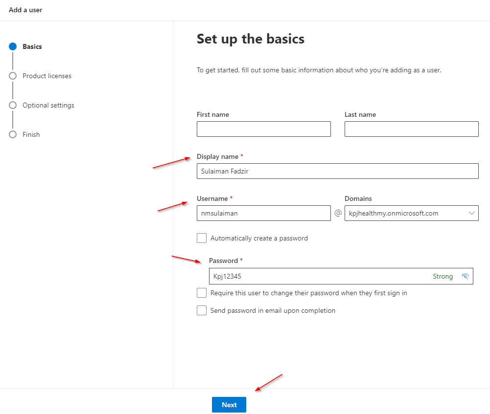

# Add New User


## **Install MSolService** only once!

### How to install `MSolService`.

**Only use** ***PowerShell***. Will not work using ***cmd*** or others command line.

1. open ***PowerShell***.
2. type
   > ``` Install-Module MSOnline ```
3. wait until installing finished.

---

#### **Warning!**

> The action below required to temporary turn off the federation( after step-5), which will stop the ALL user from accessing the Power BI KPJ tenants.
>
> Recommend to only perform this action during non-office hour.

---


## To Add User

1. Run Windows ***PowerShell*** with admin right.
2. Run the following code
   > `connect-msolservice`
3. Login screen will pop up in the browser.
4. Sign in using admin email `admin@kpjhealthmy.onmicrosoft.com`
5. After signed in back to ***PowerShell*** and run following code
   > `Set-MsolDomainAuthentication -DomainName kpjhealth.com.my -Authentication managed`
6. Check status. Type
   > `get-MsolDomain`

   
7. Go back to *Microsoft Admin Center* to add new user and assign license.
   - sign in power bi service https://app.powerbi.com/home using admin email `admin@kpjhealthmy.onmicrosoft.com`
   - in upper left conner click the *dot* icon
  
        
   - then select *Admin* menu from the list
  
        
   - click the *Show all* link 

        

    - Then select `Users > Active users`
    - In the *Active users* screen click *Add a user* button
  
        
    - In the *Add a user* screen add the user

        

    - Then assign *Power BI Pro* license

        

    - Set ImmutableID to users. In the *PowerShell* type
        > `Set-MsolUser -UserPrincipalName lmh@kpjhealth.com.my -ImmutableId lmh@kpjhealth.com.my`
        
        Note: Don't forget to change user email.
    - Verify user list. 
        > `Get-MsolUser -All | Select-Object UserprincipalName,ImmutableID,WhenCreated,LastDirSyncTime`
    
    -  Run the following script to setup SSO in the *PowerShell*.
        > `$domainName = "kpjhealth.com.my"
$Authentication = "Federated"
$FederationBrandName = "Google Cloud Identity"
$IssuerUri = "https://accounts.google.com/o/saml2?idpid=C03c20ele"
$PassiveLogOnUri = "https://accounts.google.com/o/saml2/idp?idpid=C03c20ele"
$ActiveLogOnUri = "https://accounts.google.com/o/saml2/idp?idpid=C03c20ele"
$LogOffUri = "https://accounts.google.com/logout"
$SigningCertificate = "MIIDdDCCAlygAwIBAgIGAWcP2pSgMA0GCSqGSIb3DQEBCwUAMHsxFDASBgNVBAoTC0dvb2dsZSBJ
bmMuMRYwFAYDVQQHEw1Nb3VudGFpbiBWaWV3MQ8wDQYDVQQDEwZHb29nbGUxGDAWBgNVBAsTD0dv
b2dsZSBGb3IgV29yazELMAkGA1UEBhMCVVMxEzARBgNVBAgTCkNhbGlmb3JuaWEwHhcNMTgxMTE0
MDEzNDAxWhcNMjMxMTEzMDEzNDAxWjB7MRQwEgYDVQQKEwtHb29nbGUgSW5jLjEWMBQGA1UEBxMN
TW91bnRhaW4gVmlldzEPMA0GA1UEAxMGR29vZ2xlMRgwFgYDVQQLEw9Hb29nbGUgRm9yIFdvcmsx
CzAJBgNVBAYTAlVTMRMwEQYDVQQIEwpDYWxpZm9ybmlhMIIBIjANBgkqhkiG9w0BAQEFAAOCAQ8A
MIIBCgKCAQEArF4ByC3YfSgwJfLkPclQ+5hPXtE7zkTIXkazl0s8DpZui2xD3wiucc2ABnCTekkM
0jt4EL+dEzrUMaNsLHBsc1b94gEs9NSO9EVRgUGXBJB5NVJMHvEp78UjMJrFigoghSflvX+pgvDQ
YrmIK8y5a7DD9JdvnJDsmAvBOM25l/LTu1A8ioa8jHTPGG33leTAkJhroREbnqD0RDnepEg6NzvM
uQeGKQm3+5iTrfkYMcICnLJsOauNtNMJ77/dLB2jxwDi4kciC7FIFeqCGCSg8GWxIe2Dm3FRqaZ5
yfp1iwo7sU3WqYIQY7rkMWrBCXDEC0ocZabsQFqPkoVNzSpgwwIDAQABMA0GCSqGSIb3DQEBCwUA
A4IBAQA7Mz3bC7PYYvDBCo5nw5sE3kgv9C3WVQGI3dCrehRRWBcQO3K6NuSeGdeA5oE/g9GjZ4zO
A+OnIqUPdAON5UzNfuLJ4um1IeV+ulPJD3c2txt8sFBY+bwyP57PF32ImA/QQLGgsLtjLIrTPOdL
ifdFKTg2DhAr29J7Vly3BW4HUpgBS3ig3SJk2XHHmvojF5VJf+IweXAqs1SC7aYkHpNFug7HwNzd
8HJ3ASx6viKRTx+SmHxPKUdqvykAy7R6kkUUaJRXCEkP/yJuoVnyW8L+L6EmdtqjPvFeI2Seq8c/
tgB1tNNIZjJWmfObG4WRVxwniemcomMY/J4stkDMNkuI"
`

    - Then run following code to establish the federation
        > `Set-MsolDomainAuthentication -DomainName $domainName -Authentication $Authentication -FederationBrandName $FederationBrandName -IssuerUri $IssuerUri -ActiveLogOnUri $ActiveLogOnUri -PassiveLogOnUri $PassiveLogOnUri -LogOffUri $LogOffUri -SigningCertificate $SigningCertificate -PreferredAuthenticationProtocol SAMLP
`


    - You can check your setuo with this code
        > `$domainName = "kpjhealth.com.my"
$Authentication = "Federated"
$FederationBrandName = "Google Cloud Identity"
$IssuerUri = "https://accounts.google.com/o/saml2?idpid=C03c20ele"
$PassiveLogOnUri = "https://accounts.google.com/o/saml2/idp?idpid=C03c20ele"
$ActiveLogOnUri = "https://accounts.google.com/o/saml2/idp?idpid=C03c20ele"
$LogOffUri = "https://accounts.google.com/logout"
$SigningCertificate = "MIIDdDCCAlygAwIBAgIGAWcP2pSgMA0GCSqGSIb3DQEBCwUAMHsxFDASBgNVBAoTC0dvb2dsZSBJ
bmMuMRYwFAYDVQQHEw1Nb3VudGFpbiBWaWV3MQ8wDQYDVQQDEwZHb29nbGUxGDAWBgNVBAsTD0dv
b2dsZSBGb3IgV29yazELMAkGA1UEBhMCVVMxEzARBgNVBAgTCkNhbGlmb3JuaWEwHhcNMTgxMTE0
MDEzNDAxWhcNMjMxMTEzMDEzNDAxWjB7MRQwEgYDVQQKEwtHb29nbGUgSW5jLjEWMBQGA1UEBxMN
TW91bnRhaW4gVmlldzEPMA0GA1UEAxMGR29vZ2xlMRgwFgYDVQQLEw9Hb29nbGUgRm9yIFdvcmsx
CzAJBgNVBAYTAlVTMRMwEQYDVQQIEwpDYWxpZm9ybmlhMIIBIjANBgkqhkiG9w0BAQEFAAOCAQ8A
MIIBCgKCAQEArF4ByC3YfSgwJfLkPclQ+5hPXtE7zkTIXkazl0s8DpZui2xD3wiucc2ABnCTekkM
0jt4EL+dEzrUMaNsLHBsc1b94gEs9NSO9EVRgUGXBJB5NVJMHvEp78UjMJrFigoghSflvX+pgvDQ
YrmIK8y5a7DD9JdvnJDsmAvBOM25l/LTu1A8ioa8jHTPGG33leTAkJhroREbnqD0RDnepEg6NzvM
uQeGKQm3+5iTrfkYMcICnLJsOauNtNMJ77/dLB2jxwDi4kciC7FIFeqCGCSg8GWxIe2Dm3FRqaZ5
yfp1iwo7sU3WqYIQY7rkMWrBCXDEC0ocZabsQFqPkoVNzSpgwwIDAQABMA0GCSqGSIb3DQEBCwUA
A4IBAQA7Mz3bC7PYYvDBCo5nw5sE3kgv9C3WVQGI3dCrehRRWBcQO3K6NuSeGdeA5oE/g9GjZ4zO
A+OnIqUPdAON5UzNfuLJ4um1IeV+ulPJD3c2txt8sFBY+bwyP57PF32ImA/QQLGgsLtjLIrTPOdL
ifdFKTg2DhAr29J7Vly3BW4HUpgBS3ig3SJk2XHHmvojF5VJf+IweXAqs1SC7aYkHpNFug7HwNzd
8HJ3ASx6viKRTx+SmHxPKUdqvykAy7R6kkUUaJRXCEkP/yJuoVnyW8L+L6EmdtqjPvFeI2Seq8c/
tgB1tNNIZjJWmfObG4WRVxwniemcomMY/J4stkDMNkuI"
`


